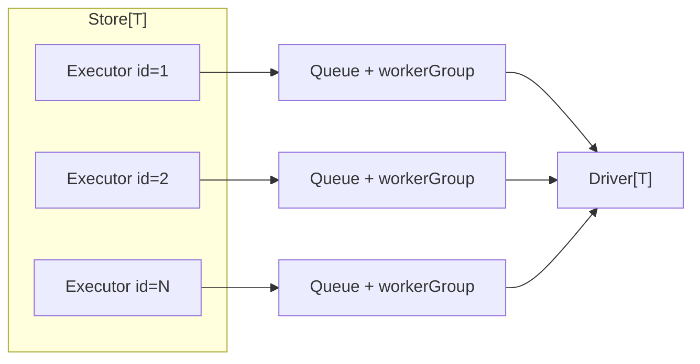
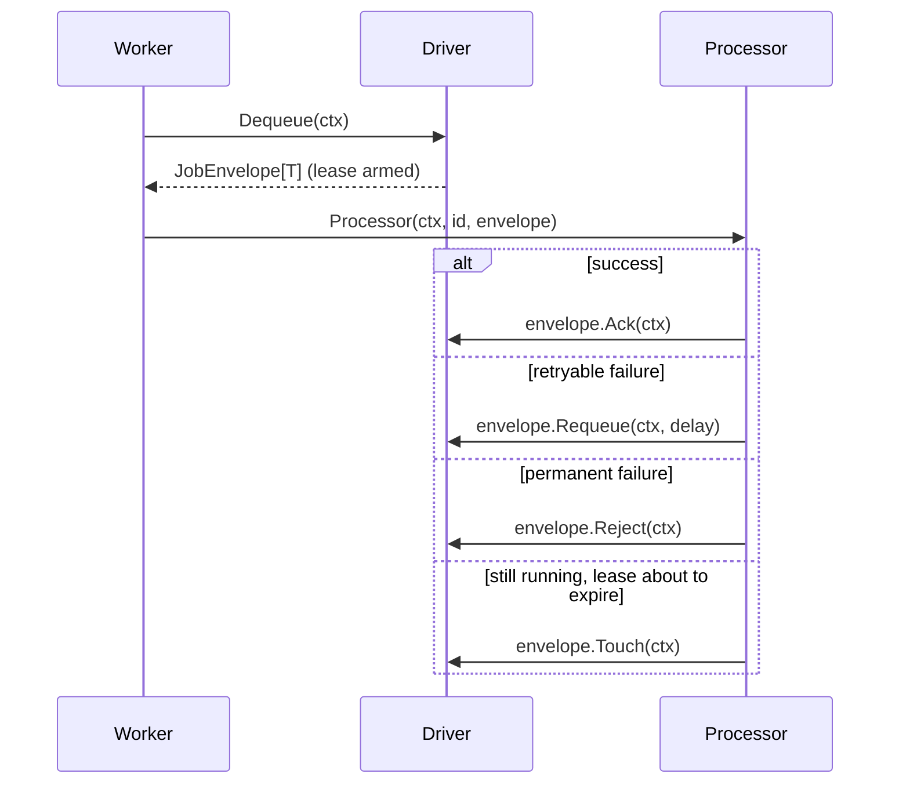

# Queues

The `core/queue` package (with the `core/queue/memory`, `core/queue/beanstalk`, and `core/queue/nats`
subpackages) provides typed job queues with explicit envelope settlement, autoscaling worker pools,
and a multi-queue store keyed by account ID.

## Concepts

| Concept | Type | Role |
|---|---|---|
| Store | `queue.Store[T]` | Owns one executor per numeric queue ID; creates them lazily; aggregates stats. |
| Executor | `queue.Executor[T]` | Operates one queue end to end: enqueue, info, drain, close. |
| Queue | `queue.Queue[T]` | Wraps a driver with lifecycle guards (intake close, dequeue cancellation). |
| Driver | `queue.Driver[T]` | Stores items and hands out envelopes. Selected per transport deployment. |
| Job envelope | `queue.JobEnvelope[T]` | A dequeued item plus metadata and settlement methods. |
| Processor | `queue.Processor[T]` | The callback that consumes envelopes. |
| Worker policy | `queue.WorkerPolicy` | Scaling bounds, ratio, idle timeout, restart delay. |



## Creating a store

A store needs three things: a driver constructor (called lazily per queue ID, so drivers can be
bound to the account), a processor shared by all queues, and a worker policy.

```go
type Job struct {
    ID        string
    AccountID int
    Payload   string
}

driverFor := func(ctx context.Context, accountID int) (queue.Driver[Job], error) {
    return memory.New[Job](memory.Options{AckWait: 30 * time.Second}), nil
}

process := func(ctx context.Context, accountID int, envelope queue.JobEnvelope[Job]) {
    job := envelope.Value()
    if err := handle(ctx, job); err != nil {
        // Retry after a minute; the attempt counter grows on every redelivery.
        _ = envelope.Requeue(ctx, time.Minute)
        return
    }
    _ = envelope.Ack(ctx)
}

jobs, err := queue.NewStore(
    driverFor,
    process,
    queue.WorkerPolicy{
        MinWorkers:    1,
        MaxWorkers:    10,
        JobsPerWorker: 10,             // aim for one worker per 10 ready items
        IdleTimeout:   time.Minute,    // worker retires after a minute without work
        ScaleInterval: time.Second,    // periodic scaling tick
        RestartDelay:  time.Second,    // throttle worker replacement after failures
    },
)
```

## Complete application example

The store owns the dequeue loop and workers. Application code only enqueues domain values and supplies
the `Processor` callback where the actual business logic starts. This complete in-memory example also
shows retry classification, a retry limit, delayed enqueue, and graceful shutdown:

```go
package main

import (
    "context"
    "errors"
    "log/slog"
    "time"

    "github.com/retailcrm/mg-transport-core/v2/core/queue"
    "github.com/retailcrm/mg-transport-core/v2/core/queue/memory"
)

type SendMessageJob struct {
    ID        string `json:"id"`
    AccountID int    `json:"accountId"`
    Recipient string `json:"recipient"`
    Text      string `json:"text"`
}

var ErrTemporary = errors.New("temporary provider failure")

func sendMessage(ctx context.Context, job SendMessageJob) error {
    // Call the provider/API here. This is the application's business logic.
    return nil
}

func processMessage(ctx context.Context, queueID int, envelope queue.JobEnvelope[SendMessageJob]) {
    job := envelope.Value()
    err := sendMessage(ctx, job)

    switch {
    case err == nil:
        err = envelope.Ack(ctx)
    case errors.Is(err, ErrTemporary) && envelope.Metadata().Attempt < 5:
        err = envelope.Requeue(ctx, time.Duration(envelope.Metadata().Attempt)*time.Second)
    default:
        // Reject validation errors and jobs that exhausted their retry budget.
        err = envelope.Reject(ctx)
    }
    if err != nil {
        slog.ErrorContext(ctx, "settle message envelope", "queue_id", queueID, "error", err)
    }
}

func run(ctx context.Context) error {
    jobs, err := queue.NewStore(
        func(context.Context, int) (queue.Driver[SendMessageJob], error) {
            // A distinct driver is required for each queue ID.
            return memory.New[SendMessageJob](memory.Options{AckWait: 30 * time.Second}), nil
        },
        processMessage,
        queue.WorkerPolicy{
            MinWorkers: 1, MaxWorkers: 8, JobsPerWorker: 20,
            IdleTimeout: time.Minute, ScaleInterval: time.Second, RestartDelay: time.Second,
        },
    )
    if err != nil {
        return err
    }

    job := SendMessageJob{ID: "msg-123", AccountID: 42, Recipient: "+15551234567", Text: "Hello"}
    if err := jobs.Enqueue(ctx, job.AccountID, job, queue.WithID(job.ID)); err != nil {
        _ = jobs.Stop(context.WithoutCancel(ctx))
        return err
    }
    if err := jobs.Enqueue(ctx, job.AccountID, job, queue.WithID("msg-124"), queue.WithDelay(time.Minute)); err != nil {
        _ = jobs.Stop(context.WithoutCancel(ctx))
        return err
    }

    <-ctx.Done() // Usually canceled by SIGINT/SIGTERM handling in main.

    shutdownCtx, cancel := context.WithTimeout(context.WithoutCancel(ctx), 30*time.Second)
    defer cancel()
    jobs.CloseIntake()
    if err := jobs.Drain(shutdownCtx); err != nil {
        _ = jobs.Stop(shutdownCtx)
        return err
    }
    return jobs.Stop(shutdownCtx)
}
```

`MinWorkers` starts consumers as soon as an executor is created. `Store.Enqueue` lazily creates that
executor, starts its worker group, stores the job, and wakes the scaling controller. Do not start a
second dequeue goroutine when using a store—the store already does that.

## Direct queue use (without managed workers)

For a command, test, or deliberately custom consume loop, wrap one driver in `queue.Queue` and call
`Dequeue` yourself. A direct queue has no autoscaling, no panic recovery, and no unsettled fallback:

```go
driver := memory.New[SendMessageJob](memory.Options{AckWait: 30 * time.Second})
jobs := queue.New(42, driver)
defer func() { _ = jobs.Close(context.WithoutCancel(ctx)) }()

if err := jobs.Enqueue(ctx, job, queue.WithID(job.ID)); err != nil {
    return err
}

envelope, err := jobs.Dequeue(ctx) // blocks until a job arrives or ctx is canceled
if err != nil {
    return err
}
if err := sendMessage(ctx, envelope.Value()); err != nil {
    return envelope.Requeue(ctx, time.Second)
}
return envelope.Ack(ctx)
```

### Enqueuing

```go
err := jobs.Enqueue(ctx, accountID, job,
    queue.WithID(job.ID),        // stable ID: enables deduplication on supporting drivers
    queue.WithDelay(5*time.Min), // or queue.WithNotBefore(deadline)
)
```

Deliveries carry `queue.Metadata` (ID, enqueue/deliver times, attempt number), which processors can
use to cap retries.

### Custom scaling

`JobsPerWorker` covers the common ratio-based scaling. For full control, provide a
`DesiredWorkersFunc`; its result is still clamped to `[MinWorkers, MaxWorkers]`:

```go
policy := queue.WorkerPolicy{
    MinWorkers:   1,
    MaxWorkers:   32,
    IdleTimeout:  time.Minute,
    ScaleInterval: 5 * time.Second,
    DesiredWorkers: func(info queue.ScaleInfo) int {
        if info.Stats.Ready > 1000 {
            return info.ActiveWorkers * 2
        }
        return int(info.Stats.Ready / 50)
    },
}
```

Scaling runs on every enqueue notification and on every `ScaleInterval` tick, so persisted or
remotely published work is discovered even without local enqueues.

## Job envelope lifecycle and settlement

Every dequeued item must be settled exactly once:



- **Ack** — work is done; the item is removed.
- **Requeue(delay)** — schedule another attempt; `Metadata.Attempt` increases on redelivery.
- **Reject** — drop the item entirely (on JetStream drivers the message is terminated).
- **Touch** — renew the driver lease for long-running processing; does not settle the envelope.

Calling a settlement method twice returns `queue.ErrJobEnvelopeSettled`. If a processor returns or
panics without settling, the envelope remains pending in the driver (the lease eventually expires
and the driver redelivers it). To observe — and optionally handle — such cases:

```go
jobs, err := queue.NewStore(driverFor, process, policy,
    queue.WithUnsettledProcessor(
        func(ctx context.Context, id int, envelope queue.JobEnvelope[Job], cause queue.UnsettledCause) {
            log.Warn("unsettled envelope",
                zap.Uint64("attempt", envelope.Metadata().Attempt),
                zap.Uint8("cause", uint8(cause.Kind)),
            )
            _ = envelope.Reject(ctx)
        },
    ),
    queue.WithPanicHandler(
        func(ctx context.Context, id int, envelope queue.JobEnvelope[Job], recovered any) {
            log.Error("processor panicked", zap.Any("panic", recovered))
        },
    ),
)
```

`cause.Kind` is `queue.UnsettledReturned` or `queue.UnsettledPanicked` (with the recovered value in
`cause.Panic`).

## Drivers

### memory (process-local)

`core/queue/memory` keeps ready, deferred, and in-flight items in the process. No codec is needed
(items are stored as-is); delayed items are scheduled with an internal heap, and leases are enforced
by timers. State is lost on restart — suitable for tests and re-creatable work.

```go
driver := memory.New[Job](memory.Options{AckWait: 30 * time.Second})
```

The default worker renews memory envelope leases while a processor runs. A custom worker must call
`envelope.Touch(ctx)` before `AckWait` expires, or the item can be handed to another worker.

### beanstalk (durable)

`core/queue/beanstalk` maps queues onto beanstalkd tubes. A `Manager` owns two dedicated connections
(producer and consumer) and reconnects them automatically on network errors.

```go
driverFor := func(ctx context.Context, accountID int) (queue.Driver[Job], error) {
    // Each executor needs its own manager because a manager is bound to one tube.
    tube := fmt.Sprintf("transport.%d.jobs", accountID)
    manager, err := beanstalk.NewManager(ctx, "beanstalkd:11300", tube, log, time.Second)
    if err != nil {
        return nil, err
    }
    return beanstalk.New[Job](manager, queue.JSONCodec[Job]{}, beanstalk.Options{
        Priority: 1,
        TTR:      time.Minute, // envelope lease
        PollTimeout: time.Second,
    }), nil // Closing the executor closes this manager.
}
```

`Reject` is aliased to `Ack` (beanstalkd has no poison-message concept), and native tube delays back
`Requeue`/`WithDelay`.
The built-in `Manager` stops reconnecting a producer when the enqueue context is canceled. Custom
`ManagerInterface` implementations can provide `PutContext` with the same arguments as `Put` plus a
leading `context.Context`; otherwise the driver falls back to `Put`.

#### Existing tubes with unwrapped jobs

The old beanstalk queue wrote the codec payload directly into the tube. The new driver writes an
envelope containing the job ID, enqueue time, and payload. When reusing a tube that may still
contain old jobs, wrap the manager before constructing the driver:

```go
manager, err := beanstalk.NewManager(ctx, address, tube, log, time.Second)
if err != nil {
    return nil, err
}
driver := beanstalk.New[Job](
    beanstalk.NewLegacyBodyAdapter(manager),
    queue.JSONCodec[Job]{},
    beanstalk.Options{Priority: 1, TTR: time.Minute},
)
```

The adapter passes new envelopes through and wraps old bodies so the codec sees their original
bytes. Use the same codec or compatible decoder that produced the old body. This also works for
non-JSON bodies with a `queue.FuncCodec`. The adapter assigns old jobs a `legacy-<beanstalk-id>`
envelope ID and an approximate enqueue time because the old format did not store that metadata.
Keep the adapter until all old jobs have been consumed; otherwise the new driver rejects and deletes
them. If old bodies happen to have the same `id`, `enqueuedAt`, and `payload` fields as a new envelope,
use a transport-specific adapter to distinguish the formats.

### nats (durable, JetStream)

`core/queue/nats` publishes items to a JetStream stream and consumes them through a durable pull
consumer with explicit acknowledgments. Deferred items use JetStream *message schedules*: the server
holds the message under `<subject>.schedule.<token>` and moves it to the queue subject at due time,
which requires `AllowMsgSchedules: true` on the stream.

```go
client, err := corenats.Connect(ctx, corenats.Config{URLs: cfg.NATSURLs}, log)
if err != nil {
    return err
}

driverFor := func(ctx context.Context, accountID int) (queue.Driver[Job], error) {
    return nats.New[Job](ctx, client, queue.JSONCodec[Job]{}, nats.Config{
        Subject: fmt.Sprintf("transport.%d.jobs", accountID),
        Stream: jetstream.StreamConfig{
            Name:              fmt.Sprintf("TRANSPORT_JOBS_%d", accountID),
            AllowMsgSchedules: true,
        },
        Consumer:  jetstream.ConsumerConfig{Name: fmt.Sprintf("transport-jobs-%d", accountID)},
        Provision: nats.Ensure, // or nats.BindExisting for externally managed infrastructure
    })
}
```

Create the shared NATS client once at application startup, pass it to every driver constructor, stop
the queue store first during shutdown, and then call `client.Drain(shutdownCtx)`. Closing a queue
driver does not close the shared client.

The enqueue ID is used as the JetStream message ID, giving publisher-side deduplication. `Stats` maps
consumer pending (Ready), scheduled messages (Deferred), and unacknowledged envelopes (InFlight).
These counts belong to the shared durable consumer, so `Drain` can wait for work owned by other
replicas. Use `DrainLocal` when shutting down one replica.

For compatibility with streams populated by direct NATS publishers, use `PayloadMode: nats.PayloadRaw`.
The codec bytes then form the entire message body, while ID and enqueue time come from NATS metadata.
Set `DisableScheduling: true` for streams without message schedules; `NakWithDelay` retries remain
available, but enqueue with `WithDelay` or `WithNotBefore` returns `queue.ErrSchedulingUnsupported`.

Configure `DeadLetter` with a subject and stream to preserve poison messages. Decode failures are
copied automatically with `X-Error` and `X-Original-Subject` headers. A processor can preserve a
terminal processing failure explicitly:

```go
if err := handle(ctx, envelope.Value()); err != nil {
    _ = queue.DeadLetter(ctx, envelope, err)
    return
}
```

### Codecs

Persistent drivers serialize items with a `queue.Codec[T]`:

- `queue.JSONCodec[T]{}` — encoding/json/v2, the default choice.
- `queue.BytesCodec{}` — pass-through for already-encoded payloads.
- `queue.FuncCodec[T]{}` — adapt functions, e.g. to restore runtime-only dependencies after decode:

```go
codec := queue.FuncCodec[*Task]{
    EncodeFunc: queue.JSONCodec[*Task]{}.Encode,
    DecodeFunc: func(data []byte) (*Task, error) {
        task, err := queue.JSONCodec[*Task]{}.Decode(data)
        if err == nil {
            err = hydrateTask(accountID, task)
        }
        return task, err
    },
}
```

## Keeping queues in sync with accounts

Transports usually run one queue per connected account. `Reconcile` aligns the executor set with the
desired account list and is safe to call periodically (for example from a JobManager job):

```go
accounts := loadActiveAccounts(ctx) // []int of account IDs
if err := jobs.Reconcile(ctx, accounts); err != nil {
    log.Error("reconcile failed", zap.Error(err))
}
```

Executors for accounts missing from the list are closed and removed; new accounts get executors
lazily or eagerly, created through the driver constructor.

## Observability

```go
stats, err := jobs.Stats(ctx) // aggregated across executors
// stats.Ready, stats.Deferred, stats.InFlight, stats.Queued()

info, ok, err := jobs.Info(ctx, accountID) // per executor
// info.LastEnqueueTime, info.Stats, info.ActiveWorkers
```

## Graceful shutdown

The store supports the standard three-phase shutdown:

```go
jobs.CloseIntake()              // 1. reject new enqueues (ErrIntakeClosed from now on)
if err := jobs.Drain(ctx); err != nil { // 2. wait until queues are empty
    return err
}
return jobs.Stop(ctx)           // 3. cancel workers, close drivers
```

For a rolling restart with shared Beanstalk or NATS queues, drain only this process:

```go
if err := jobs.DrainLocal(ctx); err != nil {
    return err
}
return jobs.Stop(ctx)
```

`DrainLocal` closes local enqueue intake, interrupts blocked dequeues, and waits for running workers
to finish. It leaves queued jobs in the driver for other replicas. Running processor contexts remain
active until `Stop`; after local draining starts, `Get` and `Enqueue` return `ErrIntakeClosed`.
`Executor` exposes `DrainLocal` for a single queue. Custom workers must return from `Run` when their
queue's `Dequeue` is canceled, and must finish any work they start before returning.

`Executor` also exposes `CloseIntake`, `Drain`, and `Close`. `Stop` is final: after it succeeds,
`Get` returns `context.Canceled`.

## Custom workers

Worker creation goes through a `queue.WorkerFactory`. Override it with `queue.WithWorkerFactory` to
wrap the default worker with instrumentation or to replace the consumption strategy entirely. A
`Worker` runs until it reports `queue.WorkerIdle` (retirable) or `queue.WorkerStopped` (will be
restarted after `RestartDelay`).
